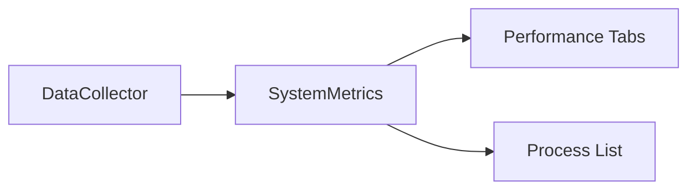

# Task Manager Documentation

## Обзор проекта
Task Manager - это приложение для мониторинга системных ресурсов Windows, состоящее из двух основных компонентов:
1. C++ DLL для сбора системной информации
2. Python GUI для отображения данных

## Структура проекта

### C++ компонент (Dll2)

#### ProcessInfo.h
```cpp
struct ProcessInfo {
    wchar_t processName[260];  // Имя процесса
    double cpuUsage;          // Использование ЦП (%)
    size_t memoryUsage;       // Использование памяти (байты)
    double diskReadRate;      // Скорость чтения с диска (байт/сек)
    double diskWriteRate;     // Скорость записи на диск (байт/сек)
    double networkSent;       // Отправлено по сети (байт/сек)
    double networkReceived;   // Получено по сети (байт/сек)
};
```

#### ProcessMonitor.h
```cpp
class ProcessMonitor {
public:
    ProcessMonitor();
    ~ProcessMonitor();
    ProcessInfo GetProcessInfo(DWORD processID);
};
```

Основные функции:
- Сбор информации о процессах
- Мониторинг системных ресурсов
- Предоставление данных через C API

### Python GUI (task_manager.py)

#### Основные классы

##### SystemMetrics
```python
class SystemMetrics:
    def __init__(self):
        self._setup_performance_counters()
        self._prev_cpu_times = self._get_cpu_times()
        self._prev_disk_counters = self._get_disk_counters()
        self._prev_net_counters = self._get_network_counters()
```
Функционал:
- Инициализация счетчиков производительности
- Сбор системной статистики
- Взаимодействие с DLL

##### TaskManagerWindow
```python
class TaskManagerWindow(QMainWindow):
    def __init__(self):
        self.collector = DataCollector()
        self.init_ui()
```
Функционал:
- Главное окно приложения
- Управление вкладками
- Обновление интерфейса

##### PerformanceTab
```python
class PerformanceTab(QWidget):
    def __init__(self, parent=None):
        self.init_data()
        self.init_ui()
```
Функционал:
- Отображение графиков производительности
- Мониторинг CPU, памяти, диска и сети
- Динамическое обновление данных

## Ключевые технические особенности

### Сбор данных (C++)
- Использование Windows API (psapi.h, pdh.h)
- Многопоточная обработка данных
- Кэширование результатов
- Оптимизированный сбор метрик

### Визуализация (Python)
- Графический интерфейс на PyQt5
- Графики реального времени
- Таблицы процессов
- Мониторинг пользователей

## Потоки данных

1. Сбор данных:


2. Обновление интерфейса:


## Основные метрики

1. CPU:
   - Общая загрузка
   - Загрузка по процессам
   - Частота процессора

2. Память:
   - Общее использование
   - Использование по процессам
   - Доступная память

3. Диск:
   - Скорость чтения/записи
   - Активность по процессам
   - Общая производительность

4. Сеть:
   - Отправка/получение данных
   - Активность по процессам
   - Общая пропускная способность

## Оптимизации

### C++ уровень
- Пул потоков для параллельной обработки
- Кэширование данных процессов
- Эффективное использование Windows API

### Python уровень
- Асинхронное обновление UI
- Буферизация данных
- Оптимизированная отрисовка графиков

## Зависимости

### C++
- Windows SDK
- Visual C++ Runtime
- PDH API

### Python
```requirements.txt
pywin32==306
wmi==1.5.1
PyQt5==5.15.9
```

## Сборка

### DLL
```bash
# Visual Studio 2022
msbuild Dll2.sln /p:Configuration=Release /p:Platform=x64
```

### Python GUI
```bash
# PyInstaller
pyinstaller --clean --onefile task_manager.py
```

## Технические требования и реализация

### 1. Независимость от среды запуска

#### Текущее состояние:
- ❌ Зависимость от Python и PyQt5
- ❌ Требуется отдельная DLL
- ✅ Использование Windows API
- ✅ Совместимость с .NET Framework

### 2. Stand-alone приложение

#### Текущее состояние:
- ❌ Внешние зависимости (Python, PyQt5)
- ❌ Отдельная DLL
- ✅ Единый exe-файл после сборки

### 3. Оптимизация ресурсов

#### Текущее состояние:
- ❌ Высокое потребление памяти (>30MB)
- ✅ CPU usage в пределах нормы (~0.7%)
- ❌ Дополнительные накладные расходы Python


### Целевые показатели

1. Ресурсы:
- CPU: <3% при нормальной работе
- Память: <60MB в пике
- Размер exe: <40MB

2. Зависимости:
- Только встроенные компоненты Windows
- .NET Framework (предустановлен)
- Visual C++ Runtime (статически слинкован)

3. Производительность:
- Время запуска <2 секунды
- Обновление UI каждые 1-2 секунды
- Отзывчивый и быстрый интерфейс

### Мониторинг соответствия требованиям

1. Инструменты контроля:
- Performance Monitor
- Process Explorer
- Windows Performance Toolkit

2. Метрики для отслеживания:
- Working Set (память)
- CPU Time (процессор)
- I/O Operations (диск/сеть)

3. Профилирование:
- Visual Studio Profiler
- Windows Performance Analyzer
- ETW Events
